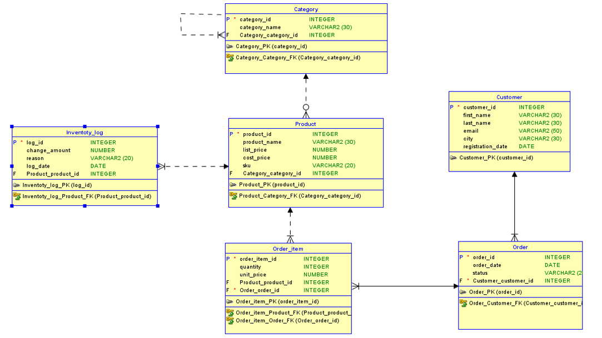
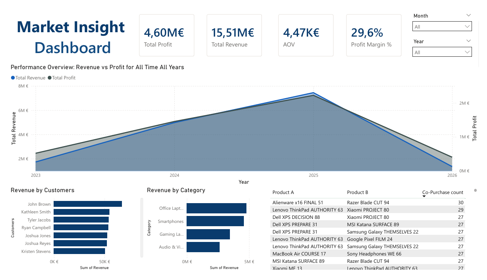

# E-commerce Data Engineering & BI Simulation project

This project is a hands-on demonstration of the full data lifecycle, bridging the gap between raw database architecture and strategic business decision-making. I designed and populated a simulated e-commerce database from scratch, using that data to extract key business metrics and build an interactive performance report.

## 📁 Project Structure
.
├── database/
│   ├── Eshop_structure.sql          # Primary DDL script (Tables, Constraints)
│   ├── Eshop_structure_full.sql     # Example of fi
│   └── EshopRelationalDia.png       # Relational Diagram (ERD) export
├── scripts/
│   ├── PoupulateScript.py           # Python ETL engine using Faker
│   └── requirements.txt             # Python dependencies (faker, cx_Oracle)
├── sql_analysis/
│   └── VirtEshopDB~1.sql            # Advanced queries (Market Basket, CLV, etc.)
├── reports/
│   ├── ReportPowerBi.png            # Dashboard screenshot for README
│   └── InteractiveReport.pbix       # Source Power BI file
└── README.md                        # Project documentation
---

## Database Design
The database is organized into six main sections: a Customer list for personal details, a Category and Product catalog to organize items (like grouping Laptops under Electronics), and the Order and Order_item records that act as the digital receipt for every sale. To keep everything accurate, a live Inventory_log tracks every stock change—whether an item is sold, returned, or restocked. This connected system ensures that every piece of information is perfectly recorded, providing the reliable data needed to create the final business reports and charts.





---

## Data Generation
The Python script acts as the store's data engine, automatically filling the database with realistic information. Using the Faker library, it generates 1,000 unique Customers, a diverse Product catalog, and 5,000 Orders with a complete Inventory_log.

You can easily adjust the size of the database to simulate a much larger or smaller business by changing the values in the Configuration section of `PoupulateScript.py`:

```python
# Change these values to scale your data
num_customers = 1000   # Increase for more users
num_products = 500     # Increase for a bigger catalog
num_orders = 5000      # Increase for more sales history
num_logs = 10000       # Increase for more inventory tracking
```

## Analytical SQL Logic
I wrote custom scripts to convert raw data into key business metrics, such as category profitability, customer rankings, and product associations. This process summarizes the data for direct use in the Power Bi

---

## Business Intelligence Dashboard
The **Power BI Dashboard** is the project's interactive visual layer.It connects directly to the SQL-processed data to track business health through dynamic charts and KPIs



Users can easily filter the entire report by month or year, allowing stakeholders to instantly compare performance trends and seasonal growth[cite: 5, 6].

---

## 🛠️ Technical Stack
* **Data Modeling:** Oracle SQL Developer Data Modeler for the design of both Logical and Relational entity-relationship diagrams (ERDs)
* **Data Generation:** Python 3.x using the **Faker** library
* **Advanced Analytics:** Oracle SQL Developer 
* **Reporting:** Power BI Desktop for data visualization
